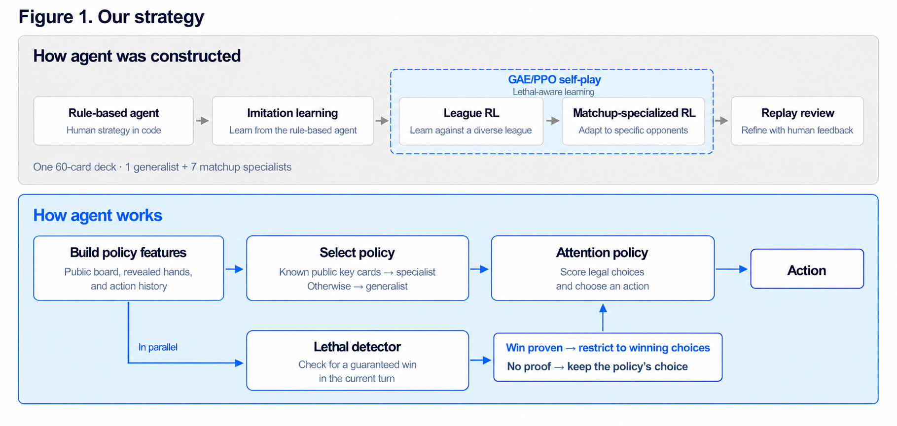

# How we constructed the agent

## Feature design

We represent the information on the board and in the hand as a variable-length set of tokens. Card
information for the board, hand, deck and discard pile is represented in **122 dimensions**, the game
as a whole in **45 dimensions**, and each legal option in **54 dimensions**. The tokens include the
Pokémon on the board, the card types remaining in our own deck, the opponent's discard pile, a summary
of the hand, recently revealed cards, and the parts of the opponent's hand that are determined from
public information.

We adopted attention because it handles a variable-length board, hand and option set within a single
framework, and naturally expresses which card or Pokémon each option targets. In addition to type,
weakness, remaining HP, Energy, Tools and Special Conditions, we supply explicit features such as the
effective damage against the current opponent and whether a knockout is guaranteed, which makes
tactically important relations easier to find with a limited amount of training.

Each policy is a small model of about **0.83M parameters** (828,481). The architecture and feature
contract of the eight policies are listed in [`manifests/models.csv`](../manifests/models.csv).

## Imitation learning

Learning even basic actions — playing cards, evolving, searching, attaching Energy — from the win/loss
reward alone takes far too much time and too many games, so we placed imitation learning in front of RL.

Festival Lead has a low usage rate, which makes it hard to collect enough game logs. We therefore
implemented our basic play policy as a rule-based agent and used its game logs as training data. This
allowed RL to start from a reasonable initial policy.

## Reinforcement learning

Starting from the imitation-learned policy, we ran league-style reinforcement learning. The value of the
selected action is estimated with GAE (Generalized Advantage Estimation), and the policy is improved with
PPO (Proximal Policy Optimization).

During RL we generated games with a **rule-based lethal detector** installed, so that the policy does not
miss a winning line and lose the reward. The detector is lightweight: it adds **3.4%** to the time per
training iteration ([`results/lethal_aware_rl/sec_per_iteration.csv`](../results/lethal_aware_rl/sec_per_iteration.csv)),
and it lets the policy reach the same win rate in fewer iterations ([results](results.md#rl-with-the-lethal-detector)).

The league trained 11 decks, including the Festival deck, with 512 games per iteration, and updated the
opponent models as training progressed, so that the agent learned general strength against a variety of
decks rather than overfitting to one fixed opponent. All training ran on three personal desktop machines
([`manifests/environment.md`](../manifests/environment.md)).

## Matchup-specialized reinforcement learning

As league training progressed, we observed that concentrating training on the matchup against one deck
lowered the win rate against another. It is difficult for a single small policy to hold the optimal play
against every deck at the same time. Weighing the remaining time, the inference time and the additional
training cost, we built small specialist policies against the major decks instead of enlarging the model.

The agent uses eight policies that share the same 60-card deck:

| Slot | Policy | Matchups it plays |
|:--:|---|---|
| a | Generalist (from league training) | every matchup not listed below |
| b | Joint high-HP specialist | Mega Lopunny ex, Mega Starmie ex, Archaludon ex |
| c | Specialist | Dragapult ex |
| d | Specialist | Alakazam |
| e | Specialist | Hydrapple ex |
| f | Specialist | Marnie's Grimmsnarl ex |
| g | Specialist | Crustle |
| h | Specialist | Mega Lucario ex |

Each specialist was trained with reinforcement learning against opponent policies that had themselves
been trained against the Festival deck.

## Human feedback

After RL, team members reviewed replays and gave feedback to correct obvious mistakes that the agent
repeated. For example, in the Dragapult ex matchup the policy undervalued putting **Rabsca** on the Bench
early, so we rewarded games won with Rabsca in play more highly than other wins. Rather than rewriting the
whole generalist policy, we corrected only the places where the cause of failure was clear. The effect is
shown in [Figure 6](results.md#human-feedback-rabsca-against-dragapult-ex).

## Lethal search

During training, the rule-based lethal detector prevents RL from losing reward by overlooking a winning
line. The lethal search used in actual play is stricter: it enumerates the actions that could lead to a
win during the current turn and searches whether they can be realized from the current hand, board,
remaining resources and searchable cards. It executes the line in the simulator's search state and adopts
a line only when a win can be proved — including every Active Pokémon the opponent could choose after the
first knockout. In positions where no win can be proved, the normal policy is used as is.

To keep the search light, each call is limited to **2 seconds, 12,288 state transitions and depth 18**
([`manifests/environment.md`](../manifests/environment.md)).

## How the agent decides

1. From the public board, hand and action history, build the features that form the policy input.
2. If the matchup can be identified from the opponent's revealed key cards, switch to the corresponding
   specialist policy; if it cannot be identified, use the generalist policy.
3. The selected attention policy evaluates the current legal options and decides the action.
4. At the same time, the lethal detector checks for a guaranteed win on the current turn. Only when a win
   is proved does it restrict the candidates to the options required for the winning line.
5. When no guaranteed win can be proved, the search does not forcibly override anything and the trained
   policy's decision is kept.

## Policy switching on public information

The switch uses only information the rules make public: the opponent's cards on the board, in the
discard pile, revealed by a search, or revealed by the opponent's mulligan. It never uses the opponent's
name, submission id, hidden hand, deck order, or the simulator's deck label. Switching is one-way — once
a specialist is selected it plays the rest of the game — and the deck tracker and public-card history are
shared across policies, so nothing the agent has learned about the opponent is lost on a switch.

The switching table maps **22 key cards** to **9 archetypes** and **7 specialist slots**
([`configs/switch_table.json`](../configs/switch_table.json)). The table is generated from the deck lists
and machine-checked so that each key card appears in no other deck of the opponent pool it was checked
against and in none of our own 60 cards:

| Archetype | Key cards (simulator ID) | Slot |
|---|---|:--:|
| Dragapult ex | Dreepy (119), Drakloak (120), Dragapult ex (121) | c |
| Alakazam | Abra (741), Kadabra (742), Alakazam (743) | d |
| Hydrapple ex | Applin (92), Hydrapple ex (150) | e |
| Marnie's Grimmsnarl ex | Marnie's Impidimp (646), Marnie's Morgrem (647), Marnie's Grimmsnarl ex (648) | f |
| Crustle | Cornerstone Mask Ogerpon ex (117), Dwebble (344), Crustle (345) | g |
| Mega Lucario ex | Riolu (677), Mega Lucario ex (678) | h |
| Mega Lopunny ex | Buneary (848), Mega Lopunny ex (849) | b |
| Mega Starmie ex | Staryu (1030), Mega Starmie ex (1031) | b |
| Archaludon ex | Duraludon (169), Archaludon ex (190) | b |
