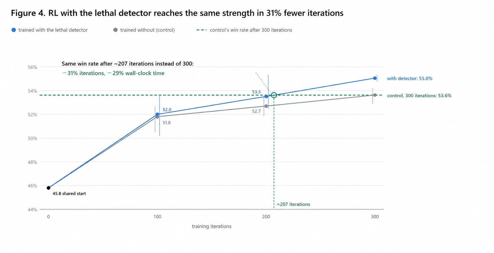
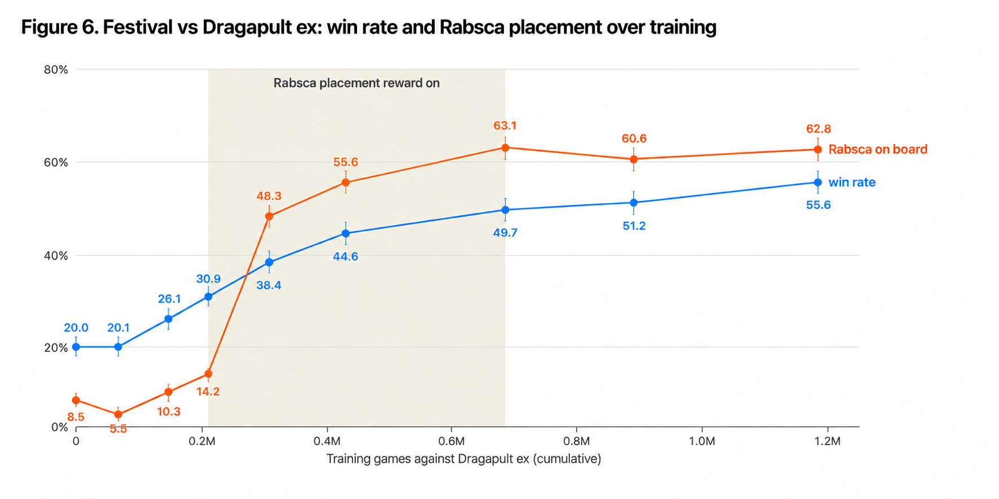

# Results and analysis

## Our results

Our final submission went **781–549 over 1,330 games (58.7%)** across the final evaluation period,
placing **26th of 6,807 teams** in the Simulation track with a final score of **1123.7**
([`results/ladder/final_result.csv`](../results/ladder/final_result.csv)).

**Table 2. Results by matchup** ([`results/ladder/results_by_matchup.csv`](../results/ladder/results_by_matchup.csv))

| Opponent deck | Games | Wins–Losses | Win rate |
|---|--:|--:|--:|
| Dragapult ex | 335 | 152–183 | 45.4% |
| Hydrapple ex | 218 | 132–86 | 60.6% |
| Slowking | 207 | 114–93 | 55.1% |
| Alakazam | 162 | 101–61 | 62.3% |
| Mega Lopunny ex | 99 | 65–34 | 65.7% |
| Crustle | 57 | 44–13 | 77.2% |
| Marnie's Grimmsnarl ex | 44 | 34–10 | 77.3% |
| Other decks | 208 | 139–69 | 66.8% |
| **Total** | **1,330** | **781–549** | **58.7%** |

Among the main matchups, the only one with a losing record was Dragapult ex; we had a winning record in
all the others.

## RL with the lethal detector

We trained the same initial policy for 300 iterations with and without the rule-based lethal detector
(three seeds each) and evaluated both on **12 held-out opponents** that were never used as training
opponents, 300 games per opponent per seed, with the lethal detector enabled during evaluation
([`results/lethal_aware_rl/win_rate_by_checkpoint.csv`](../results/lethal_aware_rl/win_rate_by_checkpoint.csv)).

| Iteration | With the detector | Without (control) |
|--:|--:|--:|
| 0 (shared start) | 45.8% | 45.8% |
| 100 | 52.0% | 51.8% |
| 200 | 53.5% | 52.7% |
| 300 | 55.0% | 53.6% |

The detector-trained policy reached the control's final win rate (**53.6%**) after about **207
iterations** — **31% fewer iterations** — and about **29% less wall-clock time** even after its **3.4%**
per-iteration overhead ([`time_to_reach.csv`](../results/lethal_aware_rl/time_to_reach.csv),
[`sec_per_iteration.csv`](../results/lethal_aware_rl/sec_per_iteration.csv)).

It also reached positions with a provable win more often, in every seed, which explains the speed-up.
This was measured at iteration 300 against 6 opponents with the detector only observing, so that it did
not change any action ([`provable_win_positions.csv`](../results/lethal_aware_rl/provable_win_positions.csv)):

| | Own turns with a provable win (mean of 3 seeds) |
|---|--:|
| With the detector | 20.3% |
| Without (control) | 18.9% |

## Matchup-specialized RL

We evaluated how much the policy split contributes to the win rate over **12 matchups × 1,000 games**,
using the submitted policies' weights and the same 60-card deck
([`results/specialists/matchup_win_rates.csv`](../results/specialists/matchup_win_rates.csv)). Each
matchup is played by the policy assigned to it, with the rule-based lethal detector enabled.

| Opponent deck | Generalist | Assigned policy | Assigned policy's win rate |
|---|--:|:--:|--:|
| Alakazam | 48.2% | d | **56.3%** |
| Dragapult ex | 25.6% | c | **56.5%** |
| Archaludon ex | 30.5% | b | **42.7%** |
| Mega Starmie ex | 35.8% | b | **54.9%** |
| Marnie's Grimmsnarl ex | 71.9% | f | **71.2%** |
| Hydrapple ex | 44.2% | e | **60.1%** |
| Crustle | 25.6% | g | **68.3%** |
| Mega Lucario ex | 46.4% | h | **61.3%** |
| Mega Lopunny ex | 35.1% | b | **71.6%** |
| Team Rocket's Mewtwo ex | 71.6% | a | **71.6%** |
| Slowking | 80.3% | a | **80.3%** |
| Teal Mask Ogerpon ex | 71.9% | a | **71.9%** |
| **Average** | **48.9%** | | **63.9%** |

Under the same conditions, the generalist model had an average win rate of **48.9%**, whereas using the
eight models selectively raised the win rate to **63.9%**.

During a game, the policy in use is switched only on the opponent's key cards that have actually been
revealed — through mulligans, the board, and so on ([`docs/agent.md`](agent.md#policy-switching-on-public-information)) —
and an incorrect switch never occurred: every switch went to the specialist assigned to the revealed
archetype, and games against the archetypes without a specialist stayed on the generalist
([`results/specialists/router_identification.csv`](../results/specialists/router_identification.csv)).

## Human feedback: Rabsca against Dragapult ex

The shaded region is where the Rabsca reward was applied. Together with the rate at which Rabsca was put
into play (**8.5% → 62.8%**), the win rate against Dragapult ex rose from **20.0% to 55.6%** — about
**2.8×** over the full range ([`results/rabsca/rabsca_vs_dragapult.csv`](../results/rabsca/rabsca_vs_dragapult.csv)).

The horizontal axis is the cumulative number of training games against Dragapult ex, taken from each
stage's training schedule and opponent mix. Each point is measured against three Dragapult ex opponent
policies and combined with weights 0.4 / 0.3 / 0.3.

| Stage | Training games vs Dragapult ex | Rabsca reward | Win rate | Rabsca in play |
|---|--:|:--:|--:|--:|
| League training, start (imitation-learned policy) | 0 | – | 20.0% | 8.5% |
| League training, checkpoint 1 | 67,000 | – | 20.1% | 5.5% |
| League training, checkpoint 2 | 147,000 | – | 26.1% | 10.3% |
| Generalist RL, checkpoint 1 | 210,000 | – | 30.9% | 14.2% |
| Generalist RL, checkpoint 2 (Rabsca reward introduced) | 308,000 | on | 38.4% | 48.3% |
| Generalist RL, checkpoint 3 | 430,000 | on | 44.6% | 55.6% |
| Dragapult ex specialist, checkpoint 1 | 686,000 | on | 49.7% | 63.1% |
| Dragapult ex specialist, checkpoint 2 | 891,000 | – | 51.2% | 60.6% |
| Dragapult ex specialist (submitted, slot c) | 1,185,000 | – | 55.6% | 62.8% |

From this we consider that we verified the hypothesis that Rabsca is the key card against Dragapult ex,
and achieved an efficient increase in win rate.
